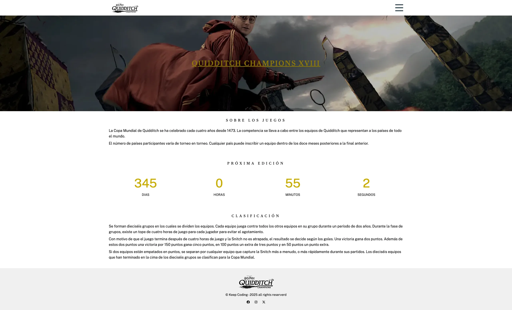
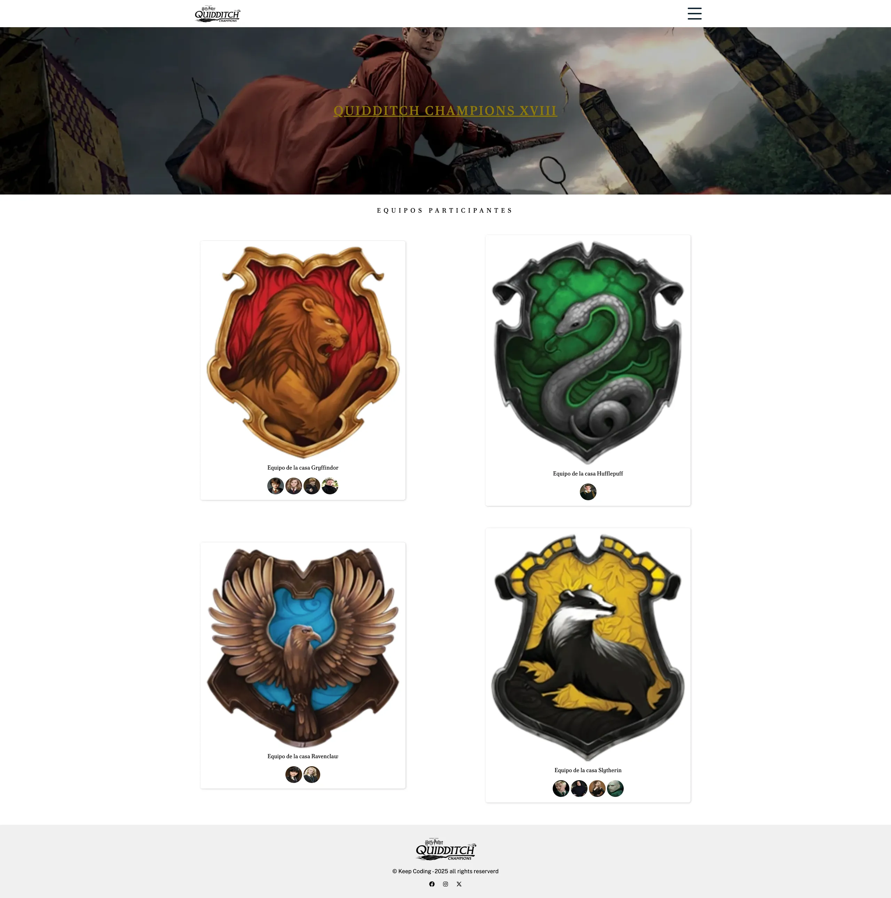
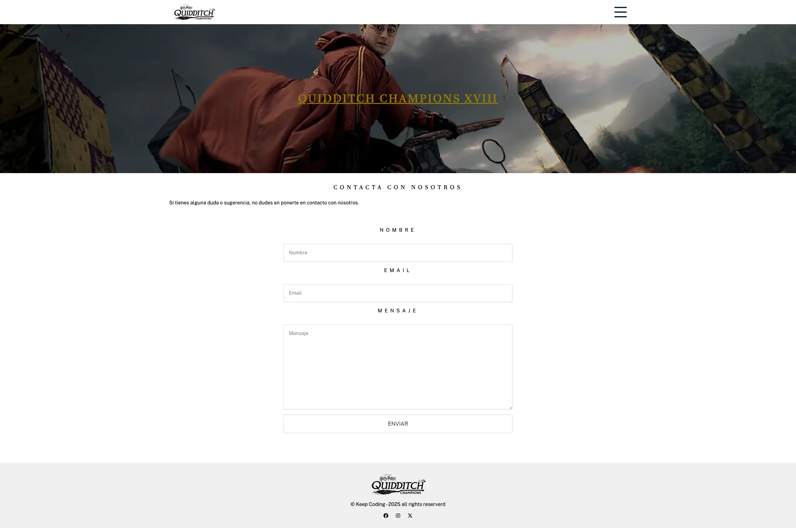

# KeepCoding Web Bootcamp XIX - Frontend PRO

    

Proyecto del módulo de Frontend PRO del Bootcamp de Web de KeepCoding.

### Requisitos
Para el seguimiento del curso vamos a utilizar las herramientas que ya conocemos:
- Visual Studio Code
- NodeJS
- NPM
- Git
- Navegador Web

### Herramientas y tecnologías utilizadas

Vamos a utilizar las siguientes herramientas y tecnologías para el desarrollo del proyecto:
- Parcel.js como empaquetador de módulos.
- HTML5 y CSS3 para la estructura y el diseño de las páginas web.
- Typescript para la programación del lado del cliente.
- SCSS Modules para el manejo de estilos.
- Tailwind CSS para el diseño responsivo y componentes predefinidos.

### Proyecto

El proyecto consiste en la creación de una página web bàsica de la final de Quidditch de Harry Potter formado por tres páginas:

#### Home

Página de bienvenida con información general sobre el evento y un contador regresivo hasta el inicio del campeonato.

    

#### Teams

Página que muestra los equipos participantes en el campeonato con sus respectivos jugadores.

    

#### Contact

Página de contacto con un formulario para que los usuarios puedan enviar sus consultas o comentarios.

    

